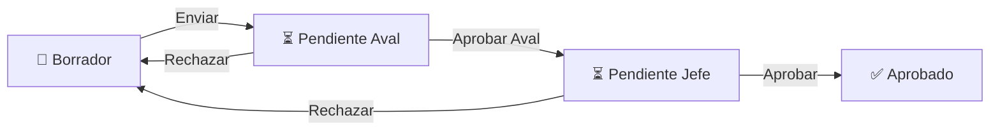

<p align="center">
  
</p>
<h1 align="center">📚 Malla Curricular — ITM</h1>
<p align="center">
  <strong>Sistema Integrado de Gestión Curricular Académica</strong><br/>
  Instituto Tecnológico Metropolitano — Ingeniería de Sistemas
</p>
<p align="center">
  
  
  
  
  
  
</p>
---
📋 Descripción
<strong>Sistema Integrado de Gestión Curricular Académica</strong> es una aplicación web completa diseñada para la gestión académica del programa de Ingeniería de Sistemas del Instituto Tecnológico Metropolitano (ITM). El sistema permite visualizar, crear y administrar la malla curricular de forma interactiva, gestionar microdiseños curriculares con flujo de aprobación, y administrar grupos académicos con inscripción de estudiantes.

🗺️ Malla Curricular Interactiva


Visualización completa de los 10 semestres con filtros, drag & drop, leyendas por tipo de asignatura y exportación a PDF 

📝 Microdiseños Curriculares
Creación, edición y gestión de microdiseños con flujo de aprobación multi-nivel (Borrador → Aval → Jefe → Aprobado) 
 
👥 Gestión de Grupos
Creación de grupos por asignatura, asignación de profesores, y gestión de novedades y momentos evaluativos 
 
📋 Inscripciones
Matriculación de estudiantes a grupos con validación de duplicados 

🔐 Autenticación por Roles
Sistema de login con tres roles diferenciados: 

Jefe de Programa, Profesor y Estudiante
📄Plantillas y Exportación
Editor de plantillas base con soporte para importación de documentos Word (.docx`) y generación de PDF

🏗️ Arquitectura
El proyecto sigue una **arquitectura en capas** basada en el patrón repositorio:
```
MallaCurricular/
├── Core/                          # Núcleo del dominio
│   ├── Application/Services/      # Servicios de aplicación (lógica de negocio)
│   └── Domain/Interfaces/         # Interfaces del dominio (contratos)
├── Infrastructure/                # Implementaciones de infraestructura
│   ├── Data/                      # Contexto de EF, entidades y modelo EDMX
│   └── Repositories/              # Implementaciones de repositorios
├── Controllers/                   # Controladores MVC y Web API
│   ├── CursosController.cs        # CRUD de asignaturas
│   ├── MallasController.cs        # Gestión de mallas curriculares
│   ├── MicrodisenosController.cs  # Flujo completo de microdiseños
│   ├── GruposController.cs        # Grupos, inscripciones, novedades
│   ├── PlantillaController.cs     # Editor de plantillas base
│   └── LoginController.cs         # Autenticación y sesiones
├── Models/                        # DTOs y modelos de vista
├── Web/                           # Frontend (HTML, CSS, JS)
│   ├── index.html                 # Panel del Jefe de Programa
│   ├── Profesor.html              # Panel del Profesor
│   ├── Estudiante.html            # Panel del Estudiante
│   ├── Microdiseno.html           # Editor de microdiseños
│   ├── Jefe.html                  # Dashboard administrativo
│   ├── Content/                   # Hojas de estilo CSS
│   └── Scripts/                   # JavaScript del frontend
└── Views/                         # Vistas Razor MVC
```
## 🛠️ Stack Tecnológico
| Capa | Tecnología |
|------|-----------|
| **Backend** | ASP.NET MVC 5 + ASP.NET Web API 2 (.NET Framework 4.8) |
| **ORM** | Entity Framework 6.2 (Database-First con EDMX) |
| **Base de Datos** | Microsoft SQL Server |
| **Frontend** | HTML5, CSS3, JavaScript, jQuery 3.7, Bootstrap 5.2, TailwindCSS |
| **Exportación PDF** | jsPDF + html2canvas |
| **Documentos** | DocumentFormat.OpenXml 3.0 + Mammoth (conversión `.docx`) |
| **Serialización** | Newtonsoft.Json 13.0 |
| **CORS** | Microsoft.AspNet.Cors + WebApi.Cors |

---

## 📦 Requisitos Previos
- [Visual Studio 2022](https://visualstudio.microsoft.com/) (o superior) con carga de trabajo **ASP.NET y desarrollo web**
- [SQL Server 2019+](https://www.microsoft.com/en-us/sql-server) (Express, Developer o superior)
- [SQL Server Management Studio (SSMS)](https://learn.microsoft.com/en-us/sql/ssms/download-sql-server-management-studio-ssms) (opcional, recomendado)
- .NET Framework 4.8 SDK

---

## 🚀 Instalación y Configuración
### 1. Clonar el repositorio
```bash
git clone [https://github.com/MigueCoding/MallaCurricular.git](https://github.com/MigueCoding/MallaCurricular.git)
cd MallaCurricular
## 🚀 Instalación y Configuración
### 1. Clonar el repositorio
```bash
git clone https://github.com/MigueCoding/MallaCurricular.git
cd MallaCurricular
```
### 2. Configurar la base de datos
Abra SSMS o su cliente SQL favorito y ejecute los scripts en el siguiente orden:
```sql
-- 1. Crear la base de datos
CREATE DATABASE MallaDB;
GO
```
```bash
# 2. Ejecutar el script principal (tablas Cursos, Mallas, MallaCursos, Usuarios)
sqlcmd -S .\SQLEXPRESS -i malladb.sql
# 3. Ejecutar el script de actualización (tablas Grupos, Inscripciones)
sqlcmd -S .\SQLEXPRESS -i UpdateDB.sql
```
### 3. Configurar la cadena de conexión
Edite el archivo `MallaCurricular/Web.config` y actualice la cadena de conexión `MallaDBEntities` con los datos de su servidor SQL:
```xml
<connectionStrings>
  <add name="MallaDBEntities"
       connectionString="metadata=...;
       provider connection string=&quot;
         data source=SU_SERVIDOR;
         initial catalog=MallaDB;
         integrated security=True;
         ...&quot;"
       providerName="System.Data.EntityClient" />
</connectionStrings>
```
### 4. Restaurar paquetes NuGet y compilar
```bash
nuget restore MallaCurricular.sln
msbuild MallaCurricular.sln /p:Configuration=Release
```
O abra la solución en Visual Studio y presione **Ctrl + Shift + B** para compilar.
### 5. Ejecutar la aplicación
Presione **F5** en Visual Studio o configure IIS Express para iniciar el servidor de desarrollo.
---
## 👤 Roles de Usuario
El sistema implementa tres roles con diferentes permisos y vistas:
### 🎓 Jefe de Programa (Rol 1)
- Visualizar y modificar la malla curricular completa
- Crear, editar y eliminar asignaturas
- Aprobar o rechazar microdiseños curriculares
- Gestionar grupos académicos y asignar profesores
- Matricular estudiantes en grupos
- Exportar la malla curricular a PDF
- Asignar roles de creador y aval para microdiseños
### 👨‍🏫 Profesor (Rol 2)
- Visualizar los grupos asignados
- Gestionar novedades y avisos de sus grupos
- Configurar momentos evaluativos (ponderación y fechas)
- Crear y editar microdiseños de sus asignaturas
- Enviar microdiseños a revisión
### 👨‍🎓 Estudiante (Rol 3)
- Visualizar sus inscripciones activas
- Consultar novedades y momentos evaluativos de sus grupos
- Visualizar microdiseños aprobados
- Responder al compromiso académico
---
## 🔄 Flujo de Aprobación de Microdiseños


---
## 📄 Licencia
Este proyecto ha sido desarrollado con fines académicos para el **Instituto Tecnológico Metropolitano (ITM)**, programa de **Tecnologia en Desarrollo de Software**.
---
<p align="center">
  Desarrollado por:<br/>
  <a href="https://github.com/MigueCoding"><strong>Miguel Casseres</strong></a><br/>
  <a href="https://github.com/samuelme2"><strong>Samuel Mejía</strong></a><br/>
  <a href="https://github.com/wDroxl"><strong>David Molina</strong></a>
</p>
